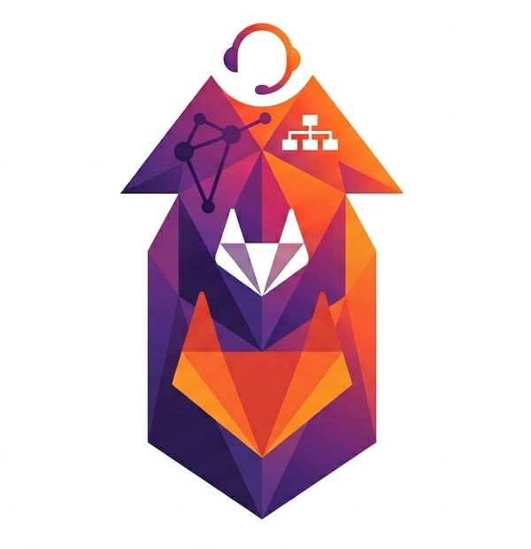

<p align="center">
  
</p>

<h1 align="center">Scree</h1>

<p align="center"><strong>Git-native knowledge, planning, and service desk for an org leaving Atlassian.</strong></p>

---

Scree is a custom application layer on top of **GitLab Ultimate (self-managed)**. It provides
the three surfaces GitLab alone does not, while reusing everything GitLab already does well
(code, issues, epics, CI, repo permissions):

1. **Knowledge management** UI for non-technical users (replacing Confluence)
2. **External customer service desk** portal with email / web / Slack intake (replacing Atlassian Service Desk)
3. **Cross-project portfolio & risk aggregation** (filling GitLab's SAFe-style gap)

All primary data is **Markdown with YAML frontmatter, stored in Git**. There is no separate
identity store (Keycloak is authoritative), no separate secrets store (Vault is authoritative),
and a **single API gateway is the only permission-enforcement point**.

## Architecture at a glance

```
            ┌────────── Web (React 19 + TS, Vite) ──────────┐
            │   knowledge · portal · portfolio/risk · admin  │
            └───────────────────────┬───────────────────────┘
                                     │  OIDC bearer (Keycloak)
                       ┌─────────────▼─────────────┐
                       │   Gateway (FastAPI)        │  ← single enforcement point
                       │   authz = GitLab RBAC ∪    │
                       │          ticket ReBAC      │
                       └──┬─────┬─────┬─────┬───┬───┘
            GitLab repos ─┘     │     │     │   └─ OpenFGA (ticket ReBAC)
         (Markdown + YAML)      │     │     └───── Vault (Transit crypto)
                          O365 ─┘     └─ Slack     Keycloak (identity / token exchange)
```

The gateway and the built web ship as **one Docker image**: the API is served at `/api`,
the SPA at `/`.

## Repository layout

| Path | What |
|---|---|
| `api/` | FastAPI gateway — the only enforcement point (`scree.asgi:app`) |
| `web/` | React + TypeScript frontend (Vite, TanStack, Radix) |
| `specs/` | Domain model, invariants, permission model, architecture, Gherkin features, fidelity & findings ledgers |
| `docs/` | Narrative: proposal, spike report, ADRs (`docs/decisions/`), design analysis |
| `charts/scree/` | Minimal Helm chart for the one-image deploy |
| `.claude/` | Diamond-workflow role profiles and shared standards |

## Documentation

The full documentation site is **generated from the specs, features, and code** and published
to GitHub Pages: **<https://witlox.github.io/scree/>**.

Build it locally:

```bash
pip install -r api/requirements.txt
SCREE_DEV=1 python docs/build.py   # assembles site/src from specs + features + API routes
mdbook build                       # renders to book/   (mdbook serve to preview)
```

## Quickstart (dev / demo)

The dev profile uses header auth and in-memory stores — no external services required:

```bash
docker compose up            # → http://localhost:8000  (API at /api)
```

Or run the gateway directly:

```bash
pip install -r api/requirements.txt
cd api && SCREE_DEV=1 uvicorn scree.asgi:app --reload
```

For a production run, leave `SCREE_DEV` unset and supply the OIDC / GitLab / Vault / OpenFGA
configuration — see [`.env.example`](.env.example). Missing config **fails closed** at startup.

## Testing

```bash
cd api && pytest -q                # unit + @api (pytest-bdd) — fast, in-process fakes + real git/crypto
cd api && pytest -q -m contract    # @contract — boots Keycloak/OpenFGA/Vault via testcontainers (nightly in CI)
cd web && pnpm test                # vitest
```

CI runs `api-tests`, the `bdd` (@api scenarios) job, `web-tests`, and a nightly `@contract` tier;
`docs` builds the site on every PR and deploys on `main`.

## Releases

Images publish to `ghcr.io/witlox/scree`. Releases run **Wednesday evenings, only when something
changed since the last tag**. The version scheme is `YEAR.ADR-COUNT.COMMIT-COUNT`
(e.g. `2026.11.420`) — the number encodes how many decisions and commits shaped the release.

## Workflow

This project uses the **diamond workflow**: analyst → architect → adversary → implementer →
auditor → adversary → integrator. There is no activation step; the active role is inferred from
the interaction and the repo state. See [`.claude/CLAUDE.md`](.claude/CLAUDE.md).

## License

[GNU AGPL-3.0](LICENSE). Network-copyleft: anyone who runs a modified Scree as a service must
publish their changes — chosen deliberately to resist the lock-in dynamics the project exists to escape.

## Naming

A *scree* is a slope of accumulated rock fragments at the base of a cliff. Organizational
artifacts — docs, tickets, risks, plans — accumulate as a pile that has shape and structure if
you read it right. Scree makes the pile navigable.
